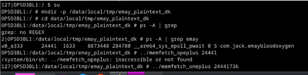
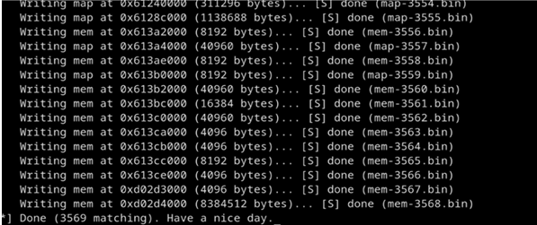
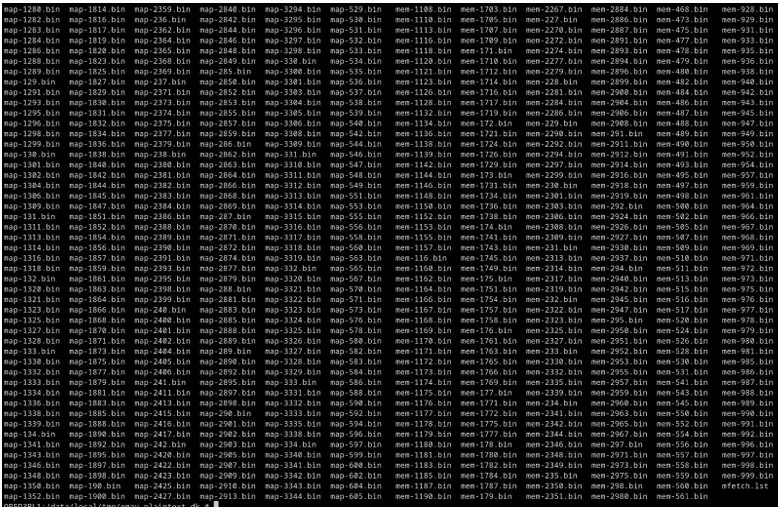
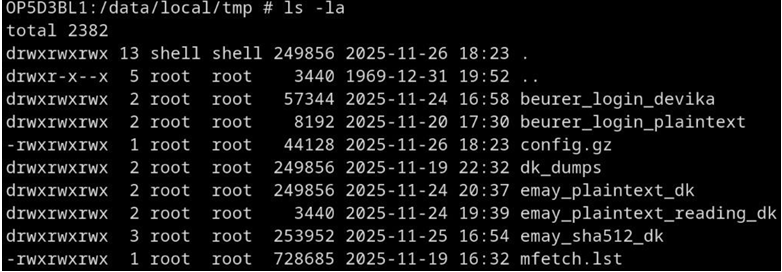
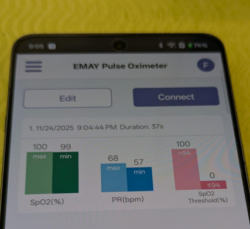

# 🧠 Learning-Memfetch: Android Process Memory Acquisition


---

## 🎯 Objective
Perform **live process memory acquisition** on a **rooted Android 15 (OnePlus 13R)** device using **Memfetch**, targeting a **medical IoT mobile app (EMAY Pulse Oximeter)**.  
This lab demonstrates how sensitive health data remains in memory (heap, stack, static) even after app use — revealing forensic visibility of **data remanence** in Android devices.

---

## 🧰 Tools & Environment

| Tool / Device | Purpose |
|---------------|----------|
| **OnePlus 13R (Android 15, Kernel 6.1.x)** | Test device (rooted) |
| **Memfetch (ARM64 build)** | Process memory acquisition utility |
| **ADB (Android Debug Bridge)** | File transfer & shell access |
| **EMAY Pulse Oximeter App** | Target process: `com.jack.emaybloodoxygen` |
| **Linux Host PC** | Analysis & storage of dumps |

---

## ⚙️ Step 1 — Setup & Deployment

1. **Push Memfetch binary to device**
   ```bash
   adb push memfetch_oneplus /data/local/tmp/memfetch_oneplus
````

2. **Switch to root shell**

   ```bash
   adb shell
   su
   ```

3. **Create working directory**

   ```bash
   mkdir -p /data/local/tmp/emay_plaintext_dk
   cd /data/local/tmp/emay_plaintext_dk
   ```

---

## 🔎 Step 2 — Identify Target Process

Locate the **EMAY Pulse Oximeter** process:

```bash
ps -A | grep emay
```

Example output:

```
24441   1633  8873448  248780  ... com.jack.emaybloodoxygen
```


*Fig-2.1 — EMAY process identified via `ps` command.*

---

## 💾 Step 3 — Execute Memfetch

Attach Memfetch to the process and start dumping:

```bash
../memfetch_oneplus 24441
```

Memfetch uses ptrace-like read operations to capture live pages from the app process.


*Fig-3.1 — Memfetch attached to EMAY app and began page capture.*

---

## 📈 Step 4 — Acquisition Progress

Memory regions (stack, heap, .data) are dumped into files such as
`mem-000.bin`, `map-000.bin`, and an index file `mfetch.lst`.


*Fig-4.1 — Dump in progress; over 3,500 regions successfully captured.*

---

## 📂 Step 5 — Verify Dump Directory

List all created dump files:

```bash
ls -la /data/local/tmp/emay_plaintext_dk
```

Expect:

* Hundreds of `mem-###.bin` and `map-###.bin`
* Index file `mfetch.lst`


*Fig-5.1 — Memory dump directory with hundreds of binary segments.*

---

## 🧾 Step 6 — Validate Dump Completion

Navigate to `/data/local/tmp` and confirm your directories:

```bash
ls -la /data/local/tmp
```

Contains multiple acquisition sessions:

* `beurer_login_devika/`
* `emay_plaintext_dk/`
* `emay_sha512_dk/`


*Fig-6.1 — Directory structure showing completed EMAY memory captures.*

---

## 💻 Step 7 — Pull Dump for Analysis

Transfer dumps to host machine:

```bash
adb pull /data/local/tmp/emay_plaintext_dk ./emay_plaintext_dk
```

Extract readable strings:

```bash
strings mem-*.bin | grep -a "SpO2"
strings mem-*.bin | grep -a "PR"
```

Expected: health telemetry fragments such as **SpO₂**, **PR(bpm)**, and timestamps.


*Fig-1.1 — EMAY Pulse Oximeter app displaying recorded health metrics before acquisition.*

---

## 📦 Step 8 — Artifacts & Outputs

| Artifact             | Description                      |
| -------------------- | -------------------------------- |
| `mem-*.bin`          | Raw memory dumps                 |
| `map-*.bin`          | Virtual memory maps              |
| `mfetch.lst`         | Memory region index              |
| `emay_plaintext_dk/` | Full plaintext capture directory |
| `emay_sha512_dk/`    | Secondary encrypted/hashed dump  |

**Completion message**

```
Done (3569 matching). Have a nice day.
```

✅ **Successful acquisition confirmed.**

---

## 🧠 Key Learnings

| Concept                       | Explanation                                                        |
| ----------------------------- | ------------------------------------------------------------------ |
| **Memory Forensics**          | Gained hands-on experience with Android volatile memory extraction |
| **Process Segmentation**      | Differentiated between .data, heap, and stack storage              |
| **Data Persistence**          | Verified residual plaintext in app memory buffers                  |
| **Forensic Chain of Custody** | Documented tools, process, and results for reproducibility         |

---

## 🔐 Security & Privacy Implications

This experiment reveals that **health data from IoT medical apps** may persist in RAM and remain recoverable after use.

**Recommendations**

1. Zeroize memory after use (`memset_s()`, `explicit_bzero()`).
2. Encrypt in-RAM structures for transient health data.
3. Use `mlock()` to prevent swapping sensitive pages.
4. Adopt hardware key storage for cryptographic operations.
5. Perform forensic reviews to confirm no plaintext data remains in memory.

---

## 🔗 Related Learning Labs

| Repository                                                                                                    | Focus                                     |
| ------------------------------------------------------------------------------------------------------------- | ----------------------------------------- |
| [Learning-Nmap](https://github.com/DEVIKA-KISH/Learning-Nmap)                                                 | Network scanning & port enumeration       |
| [Learning-WebApp-Security-BurpSuite](https://github.com/DEVIKA-KISH/Learning-WebApp-Security-BurpSuite)       | Web application vulnerability testing     |
| [Learning-Malware-Analysis-with-Ghidra](https://github.com/DEVIKA-KISH/Learning-Malware-Analysis-with-Ghidra) | Static malware reverse engineering        |
| **Learning-Memfetch (this repo)**                                                                             | Android memory forensics & data remanence |

---

## 🧩 Summary

> Demonstrates **mobile memory forensics**, **IoT data acquisition**, and **forensic investigation of process memory** in a live Android 15 environment — hands-on learning in **reverse engineering, digital forensics, and privacy-focused analysis.**

---

## 👩‍💻 Author

**Devika Kishor**
Master’s Student in Cybersecurity | Florida Institute of Technology

and **Learning-WebApp-Security-BurpSuite** repos next (with matching badges + tagline)?
```
